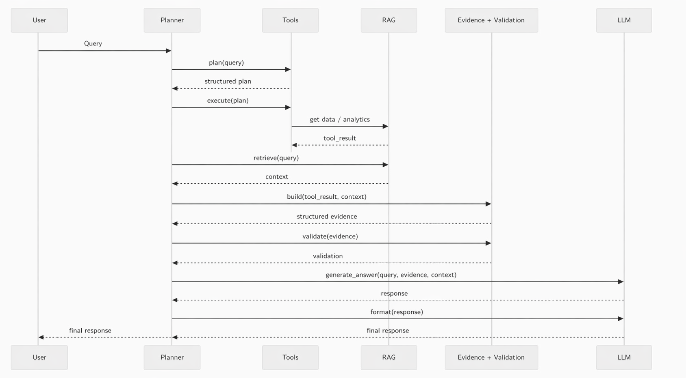

# Industrial LLM – An Evidence-Aware Architecture for Reliable Industrial AI

Evidence-Aware RAG Pipeline for Reliable Industrial AI Systems

A modular architecture that combines planning, tool execution, retrieval, evidence construction, validation, and LLM reasoning to reduce hallucinations and improve reliability in industrial environments.

## Overview

Industrial LLM is an evidence-aware framework designed for industrial AI
applications where reliability, traceability and reproducibility are critical.

The framework combines:

- Tool execution
- Retrieval-Augmented Generation (RAG)
- Evidence construction
- Validation mechanisms
- LLM reasoning

to reduce hallucinations and improve decision quality.

## Motivation

Industrial environments require reliable AI systems.

Traditional LLMs suffer from:
- Hallucinations
- Lack of traceability
- Poor integration with operational data

This project addresses these limitations through an evidence-aware architecture.

## Key Contributions

- Multi-stage reasoning pipeline
- Tool-augmented analytics
- Evidence-aware response generation
- Validation layer for hallucination reduction
- Selective Retrieval-Augmented Generation (RAG)
- Fully local deployment

## Experimental Results

### Key Results

- 94.2% Grounded Accuracy
- 3.7% Hallucination Rate
- 95.6% Task Success Rate
- 96.4% Response Consistency

Compared with a standard LLM pipeline, the proposed evidence-aware architecture:

- Improves grounded accuracy by 19.4%
- Reduces hallucinations by 82.8%
- Improves task success by 19.3%
- Improves response consistency by 17.0%

| Metric | LLM-only | RAG | Tool-Aug. | Proposed | Gain vs LLM |
|----------|----------:|----------:|----------:|----------:|----------:|
| Grounded Accuracy ↑ | 74.8% | 82.7% | 88.4% | **94.2%** | **+19.4%** |
| Hallucination Rate ↓ | 21.5% | 13.8% | 8.9% | **3.7%** | **−82.8%** |
| Task Success Rate ↑ | 76.3% | 84.9% | 89.7% | **95.6%** | **+19.3%** |
| Response Consistency ↑ | 79.4% | 86.2% | 91.1% | **96.4%** | **+17.0%** |

*↑ Higher is better. ↓ Lower is better.*

## Architecture

  

## Installation

git clone [https://github.com/ignaciodc/industrial_llm.git](https://github.com/ignaciodc/Industrial_LLM.git)

cd industrial-llm

python -m venv venv

source venv/bin/activate

pip install -r requirements.txt

| Component | Purpose |
|------------|----------|
| Planner | Task decomposition |
| Tools | Data acquisition |
| RAG | Context retrieval |
| Evidence Validation | Verification |
| LLM | Final reasoning |

## Associated Publication

This repository accompanies the research paper:

Design and Evaluation of an Evidence-Aware RAG Pipeline for Industrial LLM Applications

Submitted to Expert Systems with Applications (Elsevier).

## Reproducibility

## Reproducibility

All experiments reported in the paper can be reproduced with:

python create_machine_db.py
python build_index.py
python main.py
python experiments/evaluate.py

# Repository Structure

src/
├── planner/       Query decomposition
├── tools/         External tool execution
├── rag/           Retrieval-Augmented Generation
├── evidence/      Evidence construction
├── validation/    Evidence verification
└── llm/           Final reasoning

experiments/
├── benchmarks/
├── evaluation/
└── results/

data/
└── Industrial benchmark data

## License
MIT License

